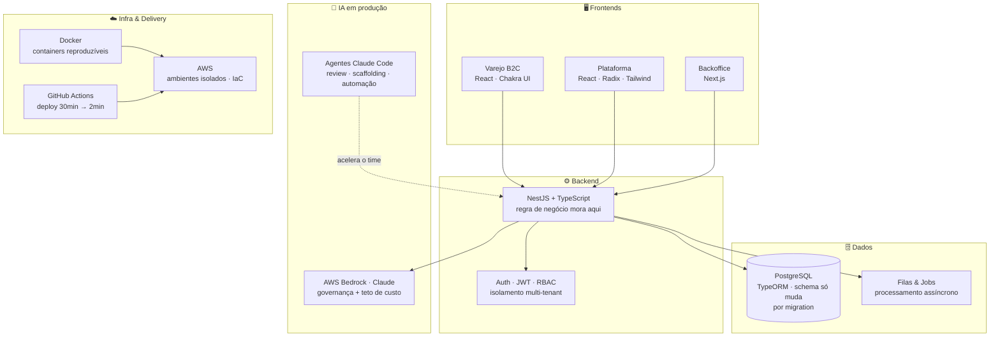

<div align="center">


[](https://github.com/1paulobarbosa)

[](https://www.linkedin.com/in/paulobarbosa)
[](mailto:paulo@buildwithsingularity.com)
[](#)


</div>

---

## 🧭 Sobre mim


Sou Tech Leader e engenheiro fullstack. Hoje sou o **único responsável técnico de um produto SaaS multi-tenant** — frontend, backend, cloud, segurança e IA — o que me obriga (e me diverte) a pensar o sistema inteiro como uma coisa só: regra de negócio no lugar certo, schema versionado por migration, deploy previsível e custo sob controle.

Nos últimos anos venho combinando **arquitetura de software** com **engenharia assistida por IA**: coloco modelos Claude em produção via AWS Bedrock e construo agentes e workflows no Claude Code com os padrões de engenharia da empresa embutidos — automação de review, scaffolding e tarefas repetitivas caíram ~60%, sobrando tempo para o que importa: system design.

```text
o que eu faço bem
├── liderar produto técnico de ponta a ponta (frontend + backend + cloud + IA)
├── arquitetura: multi-tenant, micro frontends, pipelines assíncronos
├── developer experience: CI/CD, IaC, Docker, agentes de IA
└── performance: do bundle ao banco, com número pra provar
```

<br clear="right" />

---

## 🏗️ Como eu penso um sistema

A arquitetura que opero hoje, de ponta a ponta:



---

## 🧰 Stack & Expertise

<div align="center">

[](https://skillicons.dev)
[](https://skillicons.dev)

</div>

### Linguagens & Frontend


### Backend & Dados


### Cloud, DevOps & Observabilidade


### IA & Engenharia assistida


### Qualidade & Arquitetura


---

## 📈 Impacto em números

| 🎯 | Resultado | Contexto |
|----|-----------|----------|
| 🚀 | **Deploy: 30min → 2min** | Workflow de CI/CD com GitHub Actions, containers reproduzíveis e ambientes isolados |
| 📦 | **Imagem Docker −94%** (5GB → 279MB) | Multistage builds para aplicação Next.js |
| 🔎 | **Debugging −70% · MTTR reduzido** | Biblioteca de logs com request tracing (Pino.js), ativada por feature flag em produção |
| 🤖 | **Automação repetitiva −60%** | Agentes e workflows no Claude Code com padrões de engenharia embutidos |
| ⚡ | **Milhões de linhas em segundos** | Pipeline assíncrono que destravou exportação de extratos em fintech |
| 🖥️ | **Carregamento −80%** | Otimização de performance em componentes estratégicos da plataforma |
| 🛒 | **Conversão +25% e +35%** | Twilio Segment (jornadas personalizadas) e busca com Algolia (<100ms) em e-commerce |
| 🌐 | **Core Web Vitals +65%** | Migração de Vanilla JS para JAMstack (Next.js + GraphQL) |
| ☁️ | **Provisionamento: dias → minutos** | Cultura de IaC — 100% dos ambientes AWS automatizados |

---

## 💼 Trajetória

```text
2025 — hoje   GoNext          Tech Leader — produto SaaS multi-tenant B2B2C
                              (NestJS · React · AWS · Bedrock · Claude Code)

2024 — hoje   Lerian          Software Engineer — Core Ledger, observabilidade,
                              micro frontends (Next.js · Module Federation)

2021 — 2024   Dock            Software Engineer — fintech em escala, pipelines
                              assíncronos, performance, IaC (React · Node BFF · GraphQL)

2019 — 2021   MadeiraMadeira  Front-end Engineer — e-commerce, JAMstack,
                              Design System, Algolia, Segment

2016 — 2019   JVM             Full Stack — do requisito ao app
                              (React · React Native · PHP)
```

🎓 **Análise de Sistemas** — IFRN &nbsp;·&nbsp; 🌎 **Inglês** — leitura, escrita e fala

---

## 📊 GitHub

<div align="center">


</div>

---

## 🏙️ Contribuições em 3D

<div align="center">


</div>

---

## 🐍 Contribution Snake

<div align="center">


</div>

---

<div align="center">

*"Regra de negócio no lugar certo, schema por migration, deploy previsível."*

**Bora conversar?** → [LinkedIn](https://www.linkedin.com/in/paulobarbosa) · [paulo@buildwithsingularity.com](mailto:paulo@buildwithsingularity.com)


</div>
