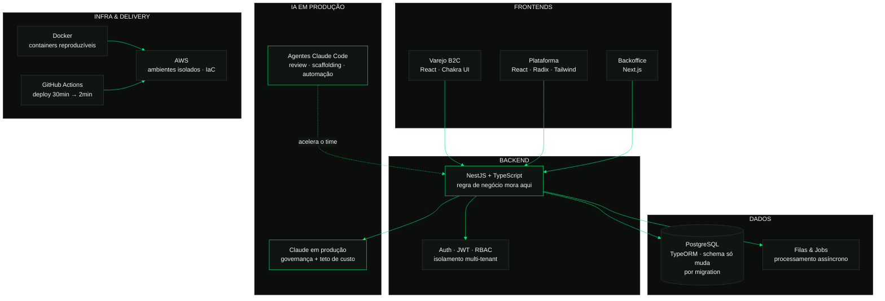

<div align="center">


[](https://github.com/1paulobarbosa)

[](https://paulobarbosa.dev)
[](https://buildwithsingularity.com)

[](https://www.linkedin.com/in/paulo-freireb/)
[](mailto:paulo@buildwithsingularity.com)
[](#)


</div>

---

## SOBRE

Sou consultor e engenheiro fullstack, e fundador do **[Singularity](https://buildwithsingularity.com)** — um product studio focado em transformar produto em faturamento.

Seis casas, quatro domínios bem diferentes. Comecei em e-commerce — varejo online de casa e construção, catálogo enorme e pico de tráfego concentrado em data comemorativa. De lá fui pra infraestrutura de pagamentos: emissão de cartão e banking as a service, o tipo de sistema que outros produtos usam de alicerce. Duas escolas opostas — uma te ensina o que volume faz com código escrito com pressa, a outra te ensina que errar custa o dinheiro de alguém.

Depois vieram viagens, numa plataforma de venda de passagem em escala, e logística de last-mile, ligando loja física a marketplace pra entrega rápida. Operação de verdade: quando o sistema cai, alguém sente na mesma hora. Em seguida, core banking open source — a primeira vez que o código que eu escrevia era lido por gente de fora da empresa, e isso muda o padrão de cuidado.

O Singularity é a soma de tudo isso: em algum ponto do caminho ficou claro pra mim que **o gargalo quase nunca é técnico**.

Em paralelo, venho combinando **arquitetura de software** com **engenharia assistida por IA**: coloco modelos Claude em produção e construo agentes e workflows no Claude Code com os padrões de engenharia do time embutidos — automação de review, scaffolding e tarefas repetitivas caíram ~60%, sobrando tempo para o que importa: system design.

```text
o que eu faço bem
├── liderar produto técnico de ponta a ponta (frontend + backend + cloud + IA)
├── arquitetura: multi-tenant, micro frontends, pipelines assíncronos
├── apps nativos iOS — Eight (Swift · SwiftUI · SwiftData)
├── developer experience: CI/CD, IaC, Docker, agentes de IA
└── performance: do bundle ao banco, com número pra provar
```

---

## ARQUITETURA

Uma arquitetura que desenhei e opero de ponta a ponta:


```mermaid
%%{init: {"theme":"base","themeVariables":{"background":"#0B0E0C","mainBkg":"#101511","primaryColor":"#101511","primaryTextColor":"#F4F6F2","primaryBorderColor":"#333A34","secondaryColor":"#101511","tertiaryColor":"#0B0E0C","lineColor":"#00E676","textColor":"#C7CCC8","nodeTextColor":"#F4F6F2","clusterBkg":"#0B0E0C","clusterBorder":"#1D221E","edgeLabelBackground":"#101511","fontFamily":"Space Grotesk, -apple-system, Segoe UI, sans-serif"}}}%%
flowchart TB
    subgraph Clients["FRONTENDS"]
        RETAIL["Varejo B2C<br/>React · Chakra UI"]
        PLATFORM["Plataforma<br/>React · Radix · Tailwind"]
        BACKOFFICE["Backoffice<br/>Next.js"]
    end

    subgraph API["BACKEND"]
        NEST["NestJS + TypeScript<br/>regra de negócio mora aqui"]
        AUTH["Auth · JWT · RBAC<br/>isolamento multi-tenant"]
    end

    subgraph Data["DADOS"]
        PG[("PostgreSQL<br/>TypeORM · schema só muda<br/>por migration")]
        QUEUE["Filas & Jobs<br/>processamento assíncrono"]
    end

    subgraph AI["IA EM PRODUÇÃO"]
        CLAUDE["Claude em produção<br/>governança + teto de custo"]
        AGENTS["Agentes Claude Code<br/>review · scaffolding · automação"]
    end

    subgraph Infra["INFRA & DELIVERY"]
        DOCKER["Docker<br/>containers reproduzíveis"]
        CICD["GitHub Actions<br/>deploy 30min → 2min"]
        AWS["AWS<br/>ambientes isolados · IaC"]
    end

    RETAIL --> NEST
    PLATFORM --> NEST
    BACKOFFICE --> NEST
    NEST --> AUTH
    NEST --> PG
    NEST --> QUEUE
    NEST --> CLAUDE
    AGENTS -. acelera o time .-> NEST
    DOCKER --> AWS
    CICD --> AWS

    classDef node fill:#101511,stroke:#333A34,color:#F4F6F2
    classDef accent fill:#101511,stroke:#00E676,color:#F4F6F2
    class RETAIL,PLATFORM,BACKOFFICE,AUTH,PG,QUEUE,DOCKER,CICD,AWS node
    class NEST,CLAUDE,AGENTS accent
```

---

## STACK

### Linguagens & Frontend


### Backend & Dados


### Mobile & Apps Nativos


**[Eight](https://eight.buildwithsingularity.com)** — app nativo iOS + Apple Watch de equilíbrio de vida 8/8/8 (Swift · SwiftUI · SwiftData · CloudKit)

### Cloud, DevOps & Observabilidade


### IA & Engenharia assistida


### Qualidade & Arquitetura


---

## IMPACTO EM NÚMEROS

| Resultado | Contexto |
|-----------|----------|
| **Deploy: 30min → 2min** | Workflow de CI/CD com GitHub Actions, containers reproduzíveis e ambientes isolados |
| **Imagem Docker −94%** (5GB → 279MB) | Multistage builds para aplicação Next.js |
| **Debugging −70% · MTTR reduzido** | Biblioteca de logs com request tracing (Pino.js), ativada por feature flag em produção |
| **Automação repetitiva −60%** | Agentes e workflows no Claude Code com padrões de engenharia embutidos |
| **Milhões de linhas em segundos** | Pipeline assíncrono que destravou exportação de extratos em fintech |
| **Carregamento −80%** | Otimização de performance em componentes estratégicos da plataforma |
| **Conversão +25% e +35%** | Twilio Segment (jornadas personalizadas) e busca com Algolia (<100ms) em e-commerce |
| **Core Web Vitals +65%** | Migração de Vanilla JS para JAMstack (Next.js + GraphQL) |
| **Provisionamento: dias → minutos** | Cultura de IaC — 100% dos ambientes AWS automatizados |

---

## TRAJETÓRIA

```text
por onde passei
├── e-commerce           varejo online de casa e construção — catálogo enorme,
│                        pico de tráfego concentrado em data comemorativa
│
├── pagamentos           emissão de cartão e banking as a service — o tipo de
│                        sistema que outros produtos usam de alicerce
│
├── viagens              venda de passagem em escala
│
├── logística last-mile  loja física ligada a marketplace pra entrega rápida —
│                        quando o sistema cai, alguém sente na mesma hora
│
├── core banking OSS     código lido por gente de fora da empresa,
│                        e isso muda o padrão de cuidado
│
└── hoje                 consultoria + Singularity, product studio
```

**Análise de Sistemas** — IFRN &nbsp;·&nbsp; **Inglês** — leitura, escrita e fala

---

## GITHUB

<div align="center">


</div>

---

## CONTRIBUIÇÕES

<div align="center">


</div>

---

## CONTATO

<div align="center">

*"Regra de negócio no lugar certo, schema por migration, deploy previsível."*

[paulobarbosa.dev](https://paulobarbosa.dev) &nbsp;·&nbsp; [buildwithsingularity.com](https://buildwithsingularity.com)

**Bora conversar?** → [LinkedIn](https://www.linkedin.com/in/paulo-freireb/) · [paulo@buildwithsingularity.com](mailto:paulo@buildwithsingularity.com)


</div>
